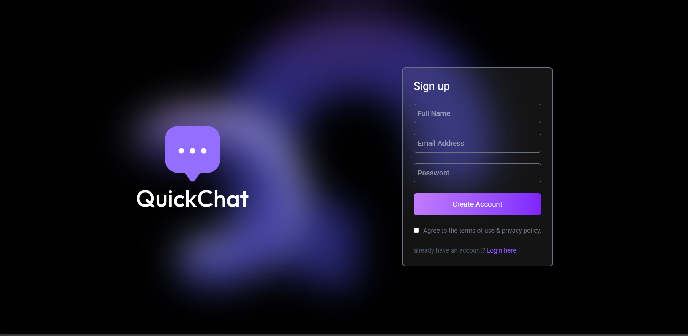

# 💬 Real-Time Chat Application

This is a full-stack real-time chat application built with the MERN stack (MongoDB, Express, React, Node.js) and Socket.IO. It supports private 1-on-1 messaging, authentication, and real-time updates like seen/unseen messages.



---

## 🚀 Features

- 🔒 User authentication (login/signup)
- 💬 Real-time 1-to-1 chat using Socket.IO
- ✅ Seen/unseen message status
- 📤 Image and text message support
- 🔔 Message notifications in sidebar
- 🌐 RESTful APIs with Express.js
- 🧠 MongoDB for storing users and messages
- 🔧 Protected routes using middleware

---

## 🛠 Tech Stack

**Frontend:**  
- React.js  
- Axios  
- Socket.IO Client  
- Context API

**Backend:**  
- Node.js  
- Express.js  
- MongoDB with Mongoose  
- Socket.IO  
- JWT for authentication  
- bcryptjs for password hashing  

---

## 📂 Folder Structure

/client
├── public/
└── src/
├── components/
├── context/
├── pages/
├── App.js
└── index.js

/server
├── controllers/
├── middleware/
├── models/
├── routes/
├── config/
├── index.js
└── .env


---

## ⚙️ Setup Instructions

### 1. Clone the repository

```bash
git clone https://github.com/yourusername/chat-app.git
cd chat-app


2. Install backend dependencies
cd server
npm install

3. Set up .env file in /server
Create a .env file in the /server directory and add the following:
PORT=5000
MONGO_URI=mongodb+srv://your-mongodb-url
JWT_SECRET=your_jwt_secret

4. Start backend server
npm run dev

5. Install frontend dependencies
cd ../client
npm install

6. Set up .env in /client (optional if needed)
Create a .env file in the /client directory and add:
VITE_BASE_URL=http://localhost:5000

7. Start React frontend
npm run dev

🔐 Add .env to .gitignore
To ensure your environment variables are not pushed to GitHub:
In your root .gitignore file, add:
client/.env
server/.env


